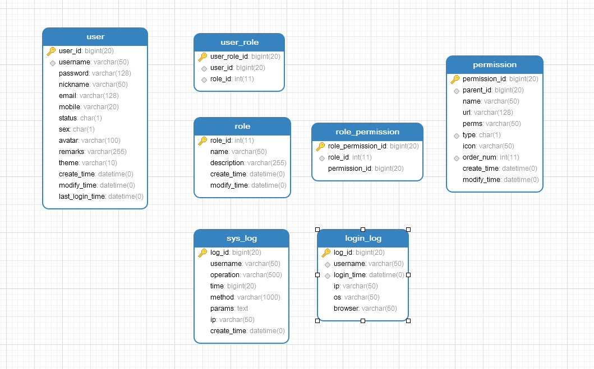
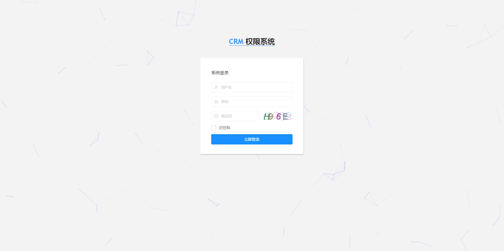
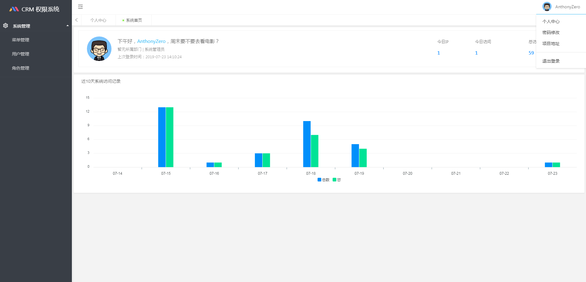
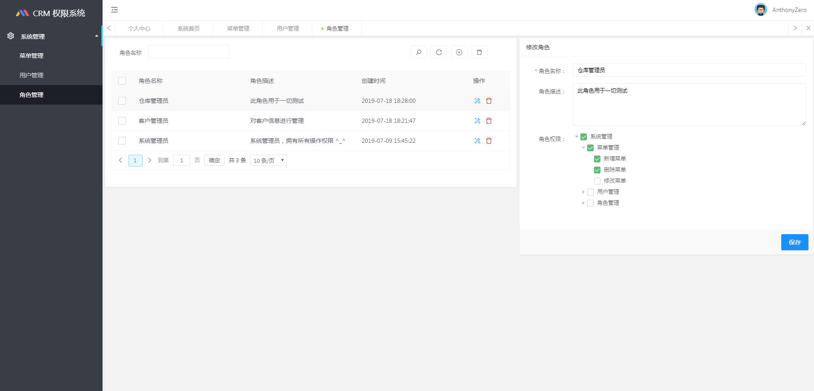
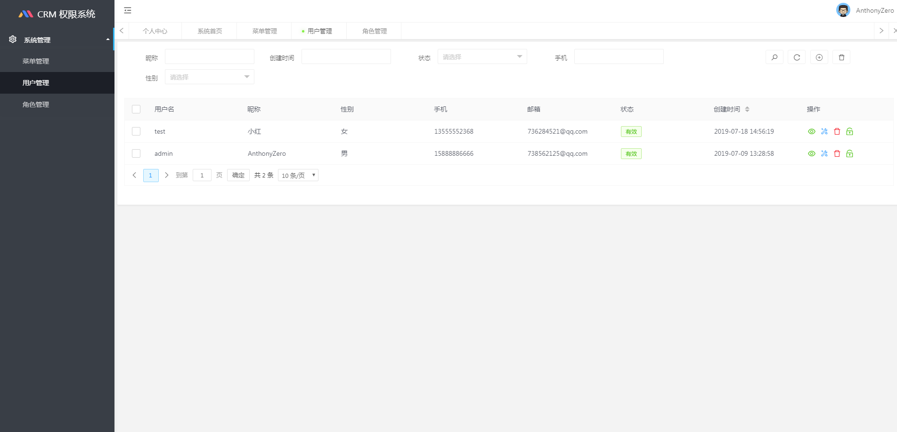

# boot-admin-scaffold
> A scaffold for background management system in springboot

### 数据库设计

### 环境依赖
> JDK1.8

> MAVEN

### 特征
* 开箱即用，无任何业务代码
* 代码规范良好，可快速上手开发一个后台系统
* 只包含系统用户、角色、权限增删改查的必要功能，业务功能需自己扩充

### 技术选型

- [Spring Boot 2.1.3](http://spring.io/projects/spring-boot/)
- [Mybatis Plus 3.1.0](https://mp.baomidou.com/guide/)
- [MySQL 5.7.x](https://dev.mysql.com/downloads/mysql/5.7.html#downloads)
- [Redis](https://redis.io/)
- [Shiro](http://shiro.apache.org/)
- [Layui 2.5.4](https://www.layui.com/)
- [FEBS-Shiro 模板](https://github.com/wuyouzhuguli/FEBS-Shiro)

### 快速体验
* 下载源码 导入到IDE中
* 创建数据库并执行项目下sql文件夹下中数据库[脚本](sql/scaffold.sql)
* 修改项目下application-dev.yml中的数据库配置和redis配置
* 启动**Redis Server**, 执行[ScaffoldSpringApplication](src/main/java/com/anthonyzero/scaffold/ScaffoldSpringApplication.java)
* 按照控制台输出进入指示页面 输入**admin**/**123456**登录并体验

### 系统截图
 

 
